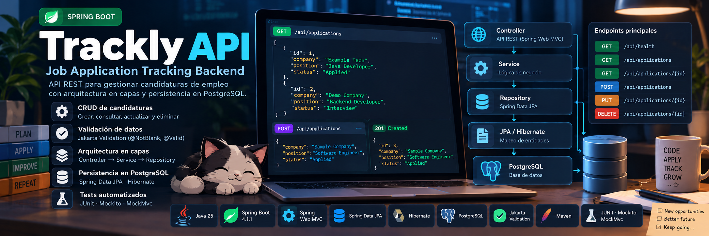

# Trackly API



A **REST API for tracking job applications**, built with **Java 25 and Spring Boot 4.1.1**. It implements persistent **CRUD** operations through a layered **Controller → Service → Repository** architecture.

- **Persistence:** Spring Data JPA / Hibernate with PostgreSQL.
- **Validation:** Jakarta Bean Validation (`@NotBlank` and `@Valid`).
- **Testing:** JUnit 5, Mockito and MockMvc for unit, HTTP and Spring context tests.

## Current features

- Persistent CRUD operations for job applications.
- Bean Validation for required application fields.
- Appropriate HTTP status codes for create, read, update, and delete operations.
- A `Location` response header that identifies a newly created resource.
- PostgreSQL persistence through Spring Data JPA and Hibernate.
- Layered Controller, Service, and Repository structure.
- Automated unit, HTTP, and Spring context tests.

## Tech stack

- Java 25
- Spring Boot 4.1.1
- Spring Web MVC
- Jakarta Bean Validation
- Spring Data JPA
- Hibernate ORM
- PostgreSQL and the PostgreSQL JDBC driver
- Maven 3.9.16 through Maven Wrapper
- JUnit 5, Mockito, and MockMvc for testing

Dependency versions managed by Spring Boot are not overridden manually.

## Architecture

```text
HTTP
  ↓
Controller
  ↓
Service
  ↓
Repository
  ↓
JPA / Hibernate
  ↓
PostgreSQL
```

- **Controller:** maps HTTP requests, validates request bodies, and builds HTTP responses.
- **Service:** coordinates application operations and handles existing or missing resources.
- **Repository:** provides persistence operations through Spring Data JPA.
- **JPA / Hibernate:** maps `JobApplication` objects to relational data.
- **PostgreSQL:** stores job applications persistently.

## API endpoints

| Method | Path | Purpose | Main responses |
| --- | --- | --- | --- |
| `GET` | `/api/health` | Check whether the API is available | `200 OK` |
| `GET` | `/api/applications` | List all job applications | `200 OK` |
| `GET` | `/api/applications/{id}` | Retrieve one job application | `200 OK`, `404 Not Found` |
| `POST` | `/api/applications` | Create a job application | `201 Created`, `400 Bad Request` |
| `PUT` | `/api/applications/{id}` | Replace the editable data of an existing application | `200 OK`, `400 Bad Request`, `404 Not Found` |
| `DELETE` | `/api/applications/{id}` | Delete a job application | `204 No Content`, `404 Not Found` |

Successful `POST` responses include the created application in the body and a header such as:

```http
Location: /api/applications/1
```

For `PUT`, the ID in the URL is authoritative. An ID supplied in the request body does not replace it.

## Validation

The following `JobApplication` fields are required and use `@NotBlank`:

- `company`
- `position`
- `status`

Null, empty, or whitespace-only values are rejected with `400 Bad Request` for validated request bodies.

Example request body:

```json
{
  "company": "Example Company",
  "position": "Java Developer",
  "status": "APPLIED"
}
```

## Database configuration

PostgreSQL must be running and the configured database and application user must already exist. The current local defaults are:

```properties
spring.datasource.url=jdbc:postgresql://localhost:5432/trackly
spring.datasource.username=trackly_app
spring.datasource.password=${TRACKLY_DB_PASSWORD}
spring.jpa.hibernate.ddl-auto=update
```

Set the database URL and username for your own environment when they differ. Keep the password outside version-controlled files and provide it through `TRACKLY_DB_PASSWORD`.

`ddl-auto=update` lets Hibernate create or update the required schema during the current learning phase. Database migrations are not implemented yet.

## Running locally

Requirements:

- Java 25
- A reachable PostgreSQL instance
- A configured PostgreSQL database and application user
- `TRACKLY_DB_PASSWORD` available in the process environment

Run on Linux or macOS:

```bash
./mvnw spring-boot:run
```

Run on Windows PowerShell:

```powershell
.\mvnw.cmd spring-boot:run
```

The application reads the database password from the environment at startup. Configure `TRACKLY_DB_PASSWORD` in your terminal or IDE run configuration before starting it.

## Tests

Run the complete test suite on Linux or macOS:

```bash
./mvnw test
```

Run it on Windows PowerShell:

```powershell
.\mvnw.cmd test
```

The Spring context test uses the configured PostgreSQL DataSource, so `TRACKLY_DB_PASSWORD` and a reachable database are required for the complete suite.

The current suite contains 24 confirmed passing tests covering:

- Service behavior and Repository interactions with Mockito.
- Controller behavior through MockMvc.
- Validation and HTTP response contracts.
- Health endpoint behavior.
- Spring application context startup.

## Project structure

```text
src/main/java/io/github/franxescajimeneez/trackly/
├── TracklyApiApplication.java
├── application/
│   ├── JobApplication.java
│   ├── JobApplicationController.java
│   ├── JobApplicationService.java
│   └── JobApplicationRepository.java
└── health/
    └── HealthController.java
```

- `JobApplication`: validated JPA entity.
- `JobApplicationController`: CRUD HTTP endpoints.
- `JobApplicationService`: application operations between HTTP and persistence layers.
- `JobApplicationRepository`: Spring Data JPA repository for `JobApplication`.

## Roadmap

Possible future improvements, not currently implemented:

- Request and response DTOs.
- Centralized error handling.
- Versioned database migrations.
- Containerization.
- Continuous integration.

## Author

[franxescajimeneez](https://github.com/franxescajimeneez)
